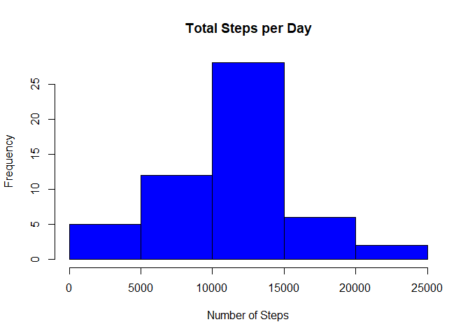
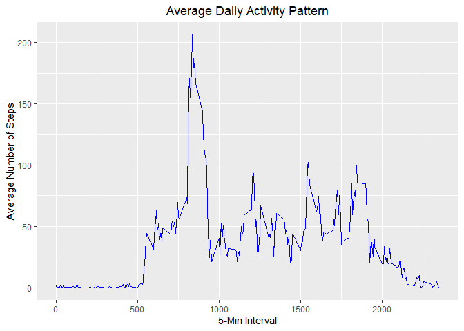
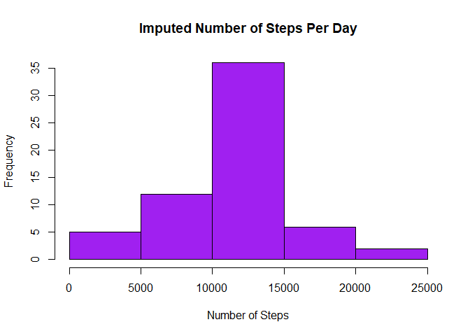

## Loading and preprocessing the data
unzip the folder and read in the data in the activity.csv file.


```r
if (!file.exists('activity.csv')){
    unzip(zipfile = "activity.zip")
}

activityData <- read.csv(file="activity.csv", header = TRUE)
```

## What is mean total number of steps taken per day?
first we calculate the total steps taken per day, then we make a histogram of the total number of steps taken per day.

```r
tot.steps <- aggregate(steps ~ date, activityData, FUN=sum, na.rm= TRUE)

hist(tot.steps$steps, col= "blue", main= "Total Steps per Day", 
      xlab= "Number of Steps")
```

<!-- -->
  now let's calculate the mean & the median of steps taken per day.

```r
meanSteps <- mean(tot.steps$steps, na.rm=TRUE)
medSteps <- median(tot.steps$steps, na.rm = TRUE)
```

## What is the average daily activity pattern?
  here, we make a time-series plot of the 5-minute interval and
  the average number of steps taken, averaged across all days.

```r
library(ggplot2)
```

```
## Warning: package 'ggplot2' was built under R version 3.6.3
```

```r
intervalMean <- aggregate(steps ~ interval, activityData, mean, na.rm =TRUE)

ggplot(data=intervalMean, aes(interval, steps)) + geom_line(col="blue") + ggtitle("Average Daily Activity Pattern") + 
  xlab("5-Min Interval") + ylab("Average Number of Steps") +
  theme(plot.title=element_text(hjust=0.5))
```

<!-- -->
  let's see which interval had the highest number of steps

```r
intervalMean[which.max((intervalMean$steps)),]
```

```
##     interval    steps
## 104      835 206.1698
```
## Imputing missing values

```r
missingval <- is.na(activityData$steps)
```
  next, we will replace 2304 missing values with 5-day average of that interval.


```r
imp_activityData <- activityData
for (i in 1:17568) #loop to find the na
  {
    if(is.na(imp_activityData$steps[i]))
    {
      five_min_point <- imp_activityData$interval[i]
      for (j in 1:288) #loop to find the value of 5 min interval
        {
        if(intervalMean$interval[j] == five_min_point)
          imp_activityData$steps[i] <- intervalMean$steps[j]
      }
    }
}
```

repeat histogram of the total number of steps per day
and calculate mean and median.
Do these values differ from estimates from the first part of the assignment?


```r
imp_intervalsteps <- aggregate(steps ~ date, imp_activityData, FUN=sum, na.rm=TRUE)

hist(imp_intervalsteps$steps, main = "Imputed Number of Steps Per Day",
     xlab="Number of Steps", col="purple")
```

<!-- -->

```r
###let's look at the histogram now

impMean <- mean(imp_intervalsteps$steps, na.rm = TRUE)
impMedian <- median(imp_intervalsteps$steps, na.rm= TRUE)
diffMean = impMean - meanSteps
diffMedian = impMedian - medSteps

diff.Tot <- sum(imp_intervalsteps$steps) - sum(tot.steps$steps)
```
We see that the mean value of the new estimates is not different from the old one. The median is also very close.

## Are there differences in activity patterns between weekdays and weekends?

we create a new variable in the dataset with two levels    of "weekend" and "weekday". We then make a panel plot to compare. 

```r
week <- weekdays(as.Date(imp_activityData$date)) 

week_day <- week
for (i in 1:17568) #loop to find the na
  {
    if (week[i] == 'Monday')
          week_day[i] <- 'weekday'
    if (week[i] =='Tuesday')
          week_day[i] <- 'weekday'
    if (week[i] == 'Wednesday')
          week_day[i] <- 'weekday'       
    if (week[i] == 'Thursday')
          week_day[i] <- 'weekday' 
    if (week[i] == 'Friday')
          week_day[i] <- 'weekday'
            
    if (week[i] == 'Saturday')
          week_day[i] <- 'weekend'
    if (week[i] =='Sunday')
          week_day[i] <- 'weekend'
}


imp_activityData$weekday <- week_day
```
now the plots:
first: we will compute the average number of steps taken again.

```r
mean.data <- aggregate(steps ~ weekday + interval, imp_activityData, FUN=mean)

head(mean.data)
```

```
##   weekday interval      steps
## 1 weekday        0 2.25115304
## 2 weekend        0 0.21462264
## 3 weekday        5 0.44528302
## 4 weekend        5 0.04245283
## 5 weekday       10 0.17316562
## 6 weekend       10 0.01650943
```
Using ggplot2, I create the panel
 

```r
library(lattice)
par(mfrow=c(2, 1))
xyplot(steps ~ interval | weekday, layout=c(1, 2), data= mean.data, type="l", lwd=1, xlab="Interval", ylab="Number of Steps")
```

<!-- -->

 
 
